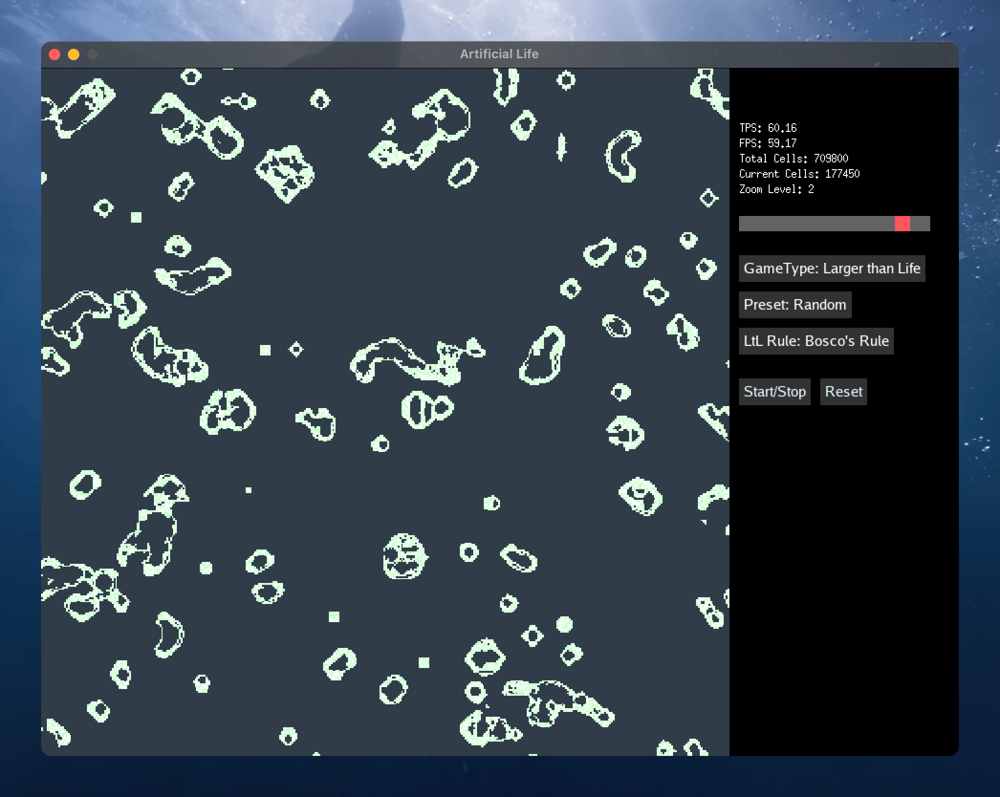

# Artificial Life: Simulating Complexity and Emergence

## Simulations

1. Conway's Game of Life
2. Larger than Life
3. SmoothLife __TODO__
4. Lenia __(TODO)__

## Conway's Game of Life

### Description

The Game of Life is a cellular automaton devised by the British mathematician John Horton Conway in 1970. It is a zero-player game, meaning that its evolution is determined by its initial state, requiring no further input. One interacts with the Game of Life by creating an initial configuration and observing how it evolves.

### Rules

The universe of the Game of Life is an infinite two-dimensional orthogonal grid of square cells, each of which is in one of two possible states, alive or dead, or "populated" or "unpopulated". Every cell interacts with its eight neighbours, which are the cells that are horizontally, vertically, or diagonally adjacent. At each step in time, the following transitions occur:

1. Any live cell with fewer than two live neighbours dies, as if by underpopulation.
2. Any live cell with two or three live neighbours lives on to the next generation.
3. Any live cell with more than three live neighbours dies, as if by overpopulation.
4. Any dead cell with exactly three live neighbours becomes a live cell, as if by reproduction.

### Implementation

The implementation is based on the [Conway's Game of Life](https://en.wikipedia.org/wiki/Conway%27s_Game_of_Life) Wikipedia page.

### Examples

#### Glider

#### Gosper glider gun

## References

- [Conway's Game of Life - LifeWiki](https://conwaylife.com/wiki/Conway%27s_Game_of_Life)
- [Larger than Life - LifeWiki](https://conwaylife.com/wiki/Larger_than_Life#:~:text=N%20%3D%20(2%20%C2%B7%207%20%2B,%3D%20225%20%2F%2025%20%3D%209.))
- [Generalization of Conway's Game of Life - SmoothLife - presentation](https://www.youtube.com/watch?v=iyTIXRhjXII&list)
- [Rafler, S. (2011). Generalization of Conway's "Game of Life" to a continuous domain - SmoothLife. ArXiv. /abs/1111.1567](https://arxiv.org/abs/1111.1567)
